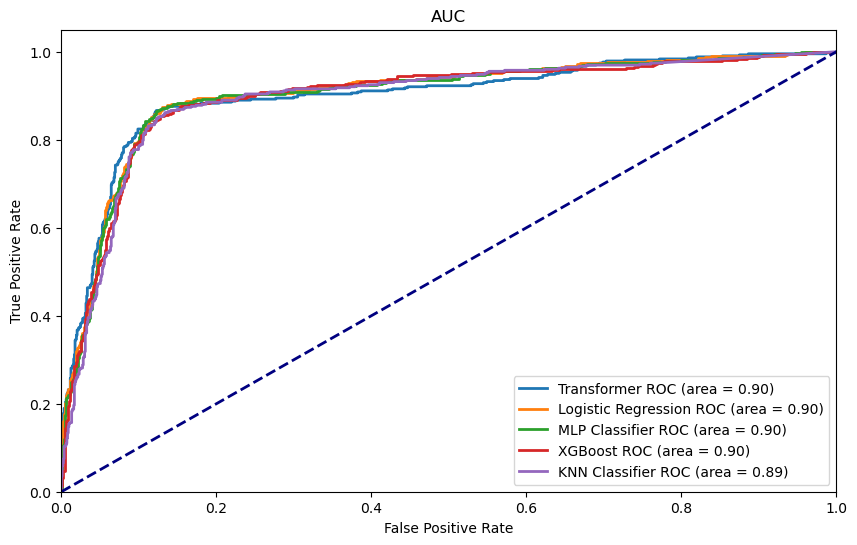

# Airbnb Property Delisting Prediction (NLP)

The goal of this project is to use Natural Language Processing (NLP) models to predict whether a property listed on Airbnb will be unlisted in the next quarter. This analysis utilizes real Airbnb property descriptions, host biographies, and guest reviews to identify patterns associated with property churn.

## Table of Contents
1. [Project Overview](#1-project-overview)
2. [Data Preprocessing](#2-data-preprocessing)
3. [Feature Engineering](#3-feature-engineering)
4. [Installation & Setup](#4-installation--setup)
5. [Project Starting Point – The Corpora](#5-project-starting-point--the-corpora)
6. [Notebooks Overview](#6-notebooks-overview)
7. [Classification Models – Model Testing](#7-classification-models--model-testing)
8. [Results & Evaluation](#8-results--evaluation)
9. [Conclusion](#9-conclusion)

---

## 1. Project Overview
This project addresses a binary classification problem:
* **Class 0:** Property remains listed.
* **Class 1:** Property becomes unlisted (churn).

The pipeline covers the entire lifecycle of an NLP project, from multilingual language detection to fine-tuning neural networks and evaluating Transformer-based embeddings.

---

## 2. Data Preprocessing

### 2.1 Language Detection & Cleaning
* **Hybrid Detection:** We employed `langdetect` and `langid`. A confidence threshold of 0.85 was used to decide between primary and secondary detection results.
* **Text Normalization:** Stripped HTML tags and non-alphabetic characters using Regular Expressions.
* **Stop-word Removal & Lemmatization:** Applied across 8 languages (English, French, Portuguese, Spanish, German, Italian, Dutch, and Russian) to standardize the text.

### 2.2 Data Integrity
To maintain data integrity, missing values in property and host descriptions were filled with an `"empty"` placeholder. This ensures that properties are not dropped simply because a specific text field was missing.

---

## 3. Feature Engineering
We compared five distinct methods to convert text into numerical vectors:

1. **Bag-of-Words (BoW):** Focuses on word frequency.
2. **TF-IDF:** Weights words based on their unique importance across the dataset.
3. **Word2Vec:** Captures semantic relationships (100-dimensional vectors).
4. **BERT (bert-base-multilingual-cased):** Generates deep contextual embeddings.
5. **LaBSE:** Specifically optimized for high-quality multilingual sentence alignment.

---

## 4. Installation & Setup

### 1. Clone the repository
```bash
git clone [https://github.com/your-username/Airbnb-predicting-property-delisting-NLP-](https://github.com/your-username/Airbnb-predicting-property-delisting-NLP-)
cd Airbnb-predicting-property-delisting-NLP-
```

### 2. Environment Setup
```bash
python3 -m venv venv
source venv/bin/activate
pip install -r requirements.txt
```

---

## 5. Project Starting Point – The Corpora

All raw data files are located in the `data/` folder, while the analytical workflow is contained within the `notebooks/` directory.

### 5.1 Dataset Contextualization
The project is built upon two main types of data: **Property Metadata** (descriptions and host info) and **User-Generated Content** (guest reviews).

* **Train Set (`data/train.xlsx`)**: 
    * **Size:** 6,248 properties.
    * **Content:** Contains Airbnb "description", "host_about", and the target variable "unlisted".
    * **Target:** `1` (removed from list/churn) vs `0` (remains listed).
* **Train Reviews (`data/train_reviews.xlsx`)**:
    * **Size:** 361,281 reviews.
    * **Context:** Contains all guest comments per property. Some properties have hundreds of reviews, others none. Reviews are highly multilingual.
* **Test Set (`data/test.xlsx`)**:
    * **Size:** 695 properties.
    * **Goal:** Does not contain labels. This set is used to generate the final predictions submitted for evaluation.
* **Test Reviews (`data/test_reviews.xlsx`)**:
    * **Size:** 41,866 reviews.
    * **Context:** Guest comments specifically for the properties listed in the Test Set.

---

## 6. Notebooks Overview

The project workflow is split into four sequential notebooks located in the `notebooks/` folder. Each step depends on the outputs (stored in `data/cleaned/`) of the previous one.

| Notebook | Description |
| :--- | :--- |
| **`01_data_exploration.ipynb`** | **Initial Analysis:** Merging the main datasets with the reviews corpora. Analyzing the class imbalance and exploring text length distributions across the 6,248 training samples. The analysis is done before and after cleaning the data. |
| **`02_preprocessing.ipynb`** | **Multilingual Cleaning:** Processing the ~400k total reviews and property texts. Includes language detection and lemmatization for the 8 identified core languages. |
| **`03_feature_engineering.ipynb`** | **Vectorization:** Converting the cleaned corpora into numerical formats. This notebook compares sparse representations (BoW, TF-IDF) and dense embeddings (Word2Vec, BERT, and LaBSE). |
| **`04_model_testing_eval.ipynb`** | **Modeling:** Training classifiers to predict the "unlisted" status and evaluating their performance. Features 5-fold cross-validation and the generation of the final `predictions/Test_predictions.csv`. |

---

## 7. Classification Models – Model Testing

To identify the most effective model, we performed a comprehensive evaluation using **TF-IDF** and **LaBSE** (our top-performing extraction techniques). 

### 7.1 Training Methodology
* **Hyperparameter Tuning:** Used `RandomizedSearchCV` for efficiency.
* **Cross-Validation:** 5-fold cross-validation was used to ensure the models generalize well across the 6,248 training instances.
* **Model Selection:** Tested linear models, deep learning (MLP), and ensemble methods (XGBoost).

---

## 8. Results & Evaluation

### 8.1 Feature Extraction Comparison (Logistic Regression Baseline)

| Metric | BoW | TF-IDF | Word2Vec | BERT | LaBSE |
| :--- | :---: | :---: | :---: | :---: | :---: |
| **Mean Accuracy** | 0.858 | **0.886** | 0.874 | 0.859 | 0.878 |
| **Mean F1 Score** | 0.745 | **0.800** | 0.785 | 0.743 | 0.786 |

### 8.2 Performance Comparison (ROC AUC Curve)


*Figure 1: Comparison of ROC Curves. The Area Under the Curve (AUC) confirms which models provide the most reliable separation between classes.*

### 8.3 Best Performing Model: MLP
The **MLP Classifier** with **TF-IDF** features was selected as the final model due to its robust non-linear learning capabilities.

**Optimal Hyperparameters:**
* `hidden_layer_sizes`: (30)
* `activation`: 'tanh'
* `solver`: 'sgd'
* `alpha`: 0.3594
  
---

## 8. Conclusion

This project highlights the efficiency of traditional NLP techniques when applied to multilingual real-world data. While Transformer models like **DistilBERT** and **LaBSE** are highly sophisticated, **TF-IDF** combined with a **Multi-Layer Perceptron (MLP)** delivered the most reliable and robust results for predicting Airbnb property delistings.

**Key Takeaways:**
* **Simplicity vs. Power:** TF-IDF remains a strong contender for text classification due to its ability to capture term importance with low computational overhead.
* **Non-Linearity:** The MLP’s ability to learn complex patterns allowed it to edge out simpler models like Logistic Regression.
* **Multilingual Success:** Our preprocessing pipeline successfully handled 8 different languages, providing a clean foundation for feature extraction.

Final predictions on the unseen test set resulted in **489** properties predicted as "Listed" and **206** as "Unlisted."
